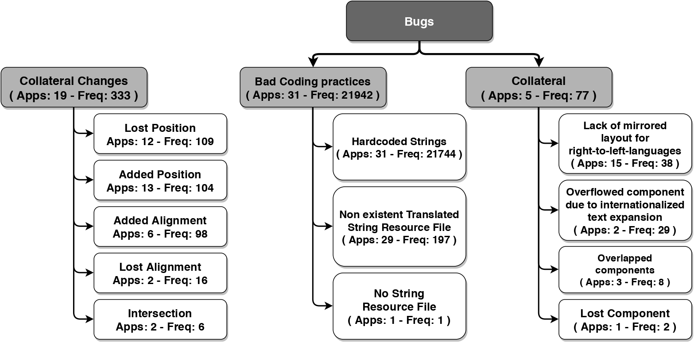
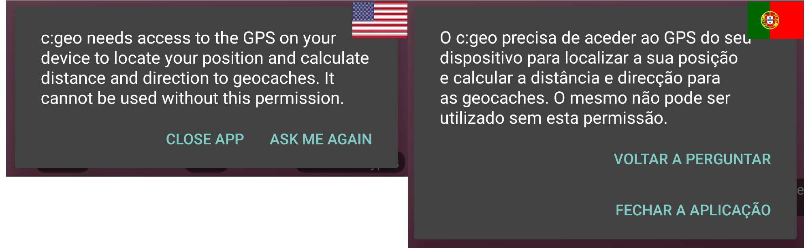
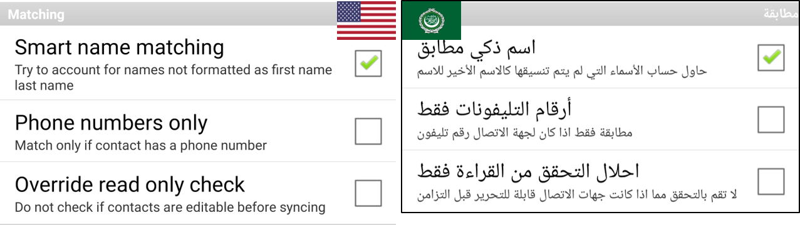
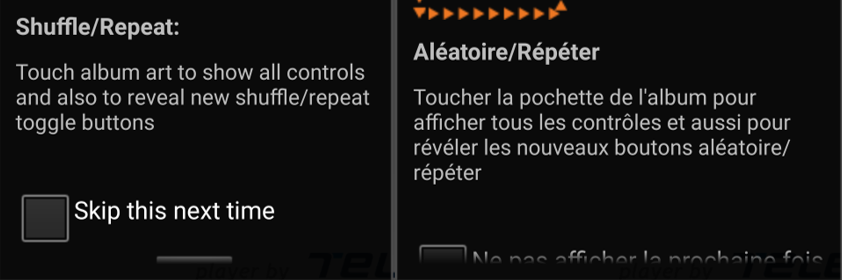

# Purpose

This project was created by The Sofware Design Lab at the Universidad de los Andes. The main goal of ITDroid project is to automatically detecting i18n
changes in Android apps in a source-codeless fashion (i.e., without having access to the apps source code). ITDroid combines APK static analysis, automated translation of strings, and dynamic analysis techniques (i.e., GUI ripping and automated replay), to identify violations of GUI constraints when simulating apps execution with different languages. ITDroid also detects strings hard coded and declared in resource and code files that are not internationalized. The proposed approach operates in a source-codeless fashions, thus, it is agnostic of the native language used for creating the app (i.e.,, Java and Kotlin) because the analysis is done at the APK level.

# Video

<p align="center">
<iframe width="500" height="282" src="https://www.youtube.com/embed/ygN5mADVhZo" frameborder="0" allow="accelerometer; autoplay; encrypted-media; gyroscope; picture-in-picture" allowfullscreen></iframe></p>

# Publications

- _"An Empirical Study of i18n Collateral Changes and Bugs in GUIs of Android apps"_, [Camilo Escobar-Velásquez](https://caev03.github.io), [Michael Osorio-Riaño](https://michaelosorio2017.github.io/), Juan Dominguez-Osorio, Maria Arevalo, and [Mario Linares-Vásquez](https://profesores.virtual.uniandes.edu.co/mlinaresv/en/inicio-en/), in _The 36th IEEE International Conference on Software Maintenance and Evolution ([ICSME'20](https://icsme2020.github.io/))_, Research Track, Adelaide, Australia, September 27th - October 3rd, 2020, to appear 10 pages (24.9% Acceptance Rate) [[DOI](https://doi.org/10.1109/ICSME46990.2020.00061)][[bibtex](/assets/pdfs/escobar2020itdroid.bib)]
  
# Summary
ITDROID is an open source tool for automatically detecting i18n bad practices and collateral changes introduced in the GUIs of Android apps. ITDROID is capable of identifying the strings that need to be translated, automatically translate them by using an external service, generate an internationalizaed APK and explore its different versions to detect and locate the changes in the GUI when using English as the default language, and 7 other languages as the target ones.
<!-- MutAPK is a mutation analysis framework for Android applications over APK Files.
MutAPK implements 35 mutation operators specifically for Android apps, covering the following categories:
- Activity/Intents
- Android Programming
- Back-End Services
- Connectivity
- Data
- Database
- General Programming
- GUI
- I/O
- Non-Functional Requirements

The complete list of mutation operators and their specification is available at the [Mutant Operators Section](http://thesoftwaredesignlab.github.io/MutAPK/#mutation-operators).
Given an Android App APK, MutAPK first extracts the Potential Fault Profile (PFP) and then automatically seeds mutants generating mutated copies of the App. -->

## Compile
Download and compile MutAPK with the following commands:
```
git clone https://github.com/TheSoftwareDesignLab/ITDroid.git
cd ITDroid
mvn clean
mvn package
```
The generated runnable jar can be found in: ``ITDroid/target/ITDroid-0.0.1.jar``

## Usage
To run ITDroid use the following command, specifying the required arguments:
```
java -jar ITDroid-1.0.0.jar <APKPath> <AppPackage> <ExtraLibsFolder> <settingsDir> <amountUnstranslatable> <OutputFolder> <emulatorID>
```

### Arguments
Provide the following list of required arguments when running ITDroid:
1. ``APKPath``: path to the app’s APK;
2. ``AppPackage``: app package name used to identify the Android app;
3. ``ExtraCompFolder``:   path to the folder that has the extra libraries used by ITDroid, for instance, this folder contains the executable file of our ripper.;
4. ``settingsDir``: path to the settings.properties file, that describes the target languages to be used during the execution.;
5. ``amountUntranslatable``: integer number greater or equal to 0; it defines the accepted difference between the amount of strings internationalized by the developer in the default language and a target language. It is used by ITDroid to decide if the app have enough strings in a target language to be considerate as translated.;
6. ``OutputFolder``: path to the folder where the results are going to be stored.;
7. ``emulatorID``: id of the emulator that is going to be used for exploring the app.;

Languagues can be selected or deselected editing the ``settings.properties`` file. To deselect a language, either comment (#) or delete the corresponding line.

### Example
```
cd ITDroid
java -jar target/ITDroid-1.0.0.jar foo.apk or.foo.app ./extra/ ./ 0 ./results/ ANDROID_6_API_27
```

### Output
The output directory will contain the results from the excuted tests and the intermediate steps

# ITDroid Workflow Overview


> ## App Processing


### **Decoding**
The workflow of ITDROID starts with the preprocessing of a given APK under analysis. By using the APKTool library, ITDROID unpackages and decodes the APK into an intermediate representation (IR) called SMALI. Our choice for having implementation rules also in SMALI is because this intermediate representation is one of the most used ones for analyzing APK files [68], and because of the availability of parsers/lexers that are easy to use and configure. Having access to SMALI code extracted directly from the APK makes it easier to repackage the app code in an APK, reducing the compilation/building time from Java source code to DEX.
### **Hard-Coded Strings Detection**
By using static analysis over the processed APK, ITDROID locates hard-coded strings. In SMALI, string literals are declared via const-string instructions. Therefore, ITDROID generates the AST of the SMALI IR and by using a visitor pattern, it goes through all nodes looking for instructions that match the desired expression. After HCSs are located, those are reported and grouped by method and class. It is worth noticing that hardcoded strings are not translated yet by the current version of ITDroid.
### **Non-Internationalized Strings** 
Regarding the strings defined in the strings.xml files, ITDROID identifies the NISs by comparing the existent language files to the one defined in the default resource folder. For this, ITDROID compares the XML files and computes the amount of strings that are missing in the existing target language files. To this, ITDroid generates a set of tuples of the form: ```<language,stringID>```, where language could be either the default or a target language, and the stringID is the id used in the resource file as identifier. Then, ITDROID compares the language tuples and computes the amount of strings missing in a target language. Using the computed amount, it classifies the language as translated or not, based on a threshold of maximum number of NISs provided by the user when executing ITDROID. Then it stores the identifier of the non-translated languages for further processing.


> ## Translation
ITDROID starts with the automated translation process by going through every language in the non-translated languages list, then it uses an external service (e.g., IBM watson) to translate the missing strings and creates a translated version of the strings.xml file with the NISs. After that, ITDroid builds an internationalized APK. More details in the aforementioned process are presented as follows:
### **Strategy Design Pattern**
In order to enhance the extensibility of ITDROID we designed the translation process to follow the Strategy Design pattern for ease the addition of other translation systems. Therefore, if a user wants to add its own translation service, she only has to create a class implementing the requirements of the “TranslatorInterface”. For the current version of ITDroid we used the IBM Watson Translation service, since it has a free and easy to use API.
### **Request building**
The translation process starts by preprocessing the NISs to replace the text placeholders (i.e., $s, $d) used for string formatting for a set of placeholder we designed to avoid affecting the translation process. It is worth noticing, that this placeholder replacement is performed while building the request for the API, it does not modify the values stored in the strings.xml files. When the result of the API is received, it is processed to inject the original text holders and to escape the characters that do not belong to UTF-8 encoding. Since we were working with IBM translation service, we had length constraints for the amount of characters in a request, therefore, we divided the NISs into sets of 50 strings, and generated multiple requests to the API to translate the full set of NISs. The amount of strings used for each request was computed based on the behavior of the API while we performed our tests.

### **File Creation**
After the translation process for a language ends, the translated strings are stored in the corresponding ```strings.xml``` file for each target language, i.e., inside the target language folder (i.e., ```./rsc/values-<targetLanguageID>/```). In case the target language already had some translated strings, the newly translated ones are appended to the existing file.

### **APK building**
Finally, after the NISs have been analyzed and translated to the target languages, ITDROID uses the APKTool library to build the internationalized APK containing all the languages files. Note that the new version of the app is ready to be installed and tested using any of the selected languages.

> ## Ripping and Replay

In order to identify the graphical impact of using a translated version of the app, we rely on systematic exploration to go through the app retrieving information that could be used to generate a model. That model contains the information of all elements in the GUI for the visited states and enables the comparison of location and relation properties from the same element in the different language’s versions.

### **Systematic Exploration and Re-execution of app exploration**
Having in mind that we wanted to recognize the changes in the GUI, we opted to explore the apps using a systematic exploration approach. To this, we extend the ripper by Li˜n´an et al. [12]. With the ripper, we extracted visual properties of the visited states to build layout graphs and an events log that allowed further re-execution of the same exploration sequence but on an internationalized version of the original APK.

### **Layout Graphs (LGs)**
Once the original APK has been explored, ITDROID generates a Layout Graph, which represents the existing relations between the elements of the interface. For example, consider the elements presented in the next figure; as it can be seen by the color coding, there are relations based on the alignment of the buttons.
An aggregation of all the relations between any pair of elements in a GUI, is called Layout Graph (LG). It is worth noticing that during the exploration of the app, ITDROID generates a LG for each visited GUI state, therefore at the end of the execution, a set of LGs identified by the id of the corresponding state is generated for comparison.

> ## Detection
ITDROID generates a LG (LGdflt) for the default language, and a layout graph LGlang for each target language lang. Each LGlang is compared to LGdflt to detect differences.

### **Comparison of LGs**
In order to compare the LGs of original and internationalized versions, ITDROID starts by pairing LGs of visited states, afterwards ITDROID pairs the elements of the LGs using their identifiers; this is possible since the elements of the LGs are also the elements of the GUI of the app; in case an element does not have a valid value in the id property, a new id can be computed using the xpath and its properties. Once the elements of the LGs are paired, the comparison is made by identifying the differences between the relations presented in the LGs. For example, consider the screenshots presented in Fig. 3. After translating the app to Russian the “Find devices” button loses the bottom alignment with the other buttons, which is an example of an internationalization collateral change.

### **Report Generation**
ITDROID generates a report listing (i) hard-coded strings, (ii) non-internationalized strings declared in the default language but not traduced in the target languages, and (iii) internationalization collateral changes. To easily handle ICCs, ITDROID reports the changes by identifying: (i) the exploration state id, (ii) the id of the node, (iii) each node for which a relation was modified along with the details of the modified relations, and (iv) screenshots depicting the GUI state for both default and internationalized languages.


# Taxonomy of _i18n_ collateral changes and bugs




## _i18n_ Collateral Bugs

In general, most of the reported ICBs are caused by incorrect definition of constraints on components with text and the lack of tools supporting automated detection and fixing. The bugs induced by internationalized text expansions can also be easily fixed by using the ellipsize attribute of the GUI components. In addition, although, ITDroid is a partial solution that helps developers to detect IBCPs and ICCs, they have to manually go over the ICCs reported by ITDroid to identify ICBs. Therefore, future work could focus on extending the ITDroid approach for automatically detecting the bugs by relying on automated imagebased comparisons or by statically detecting (i) constraints incompatibilities and issues, and (ii) missing configurations and resources for enabling bidirectionality. Other potential impact of the IBCPs and ICBs described here, but not investigated in our study, is related to the behavior of screen readers when IBCPs and ICBs are exhibited in internationalized apps explored by users with visual disabilities. Although it is an aspect not deeply investigated yet, an empirical study by Vendome et al. reports that internationalization of assistive content in Android apps is a concern expressed by some developers at Stack Overflow.

### <ins>Overflowed component due to internationalized text expansion</ins>
This type of bug is visible in GUIs because it breaks the original design when large texts push the components to be out of their expected dimensions, positions and alignments. For instance, following image shows how in the cgeo.geocaching app, when changing to Portuguese, the horizontal arrangement of the dialog buttons is pushed to be vertical because of internationalized text expansion in the buttons. When looking into the details of the cgeo.geocaching app’s layout we found that the bug is exhibited by an Android AlertDialog. Therefore, developers must be aware that even Android composite widgets are prone to i18n bugs. We also found that using linear layouts instead of constraints layout is a common error in Android apps. Junior developers prefer linear layouts because are easier to use; constraint layouts are more complex to handle when there is no deep knowledge of the available constraints. In addition to being performance friendly, constraint layouts can help developers to avoid issues when dimensions of GUI components are modified dynamically. Therefore, developers should be knowledgeable of the constraint types and be aware that changes in text lengths can break the layout drastically, in particular when changing the default language.


### <ins>Lack of mirrored layout for right-to-left languages</ins>
It is produced when developers do not consider bidirectionality in their layouts. Bidirectionality means that for languages that read from right-to-left (RTL), UIs should be mirrored to ensure understandability. One example of this bug is presented as follows. To avoid this type of bugs, developers should follow bidirectionality guides that describe how to mirror layouts at the design concept and implementation levels. Static tools can be a solution here, by automatically analyzing and implementing the bidirectionality and RTL guidelines.



### <ins>Lost Component</ins>
type relates to cases in which a visible component, is pushed out of the display view because a text component is re-dimensioned, see following image. This does not seem to be a problem at first sight, however, this type of issue could hinder the execution of automated tests that expect certain components to be visible.



### <ins>Overlapped Components</ins>
It is mainly caused by the lack of proper constraints between two elements. This bug can happen between two aligned elements. 


# Replication package

To see the result of our study download our [replication package](./resources/execResults/ITDroidOutput.zip)
<!-- ## App List -->
---

<!-- | App Name | Package Name | MutAPK Output* | 
|----------|--------------|--------|
| A2DP Volume | a2dp.Vol | [output](https://github.com/TheSoftwareDesignLab/MutAPK/tree/gh-pages/resources/execResults/a2dp.Vol)| 
| Quick Settings | com.bwx.bequick | [output](https://github.com/TheSoftwareDesignLab/MutAPK/tree/gh-pages/resources/execResults/com.bwx.bequick)|
| Book Catalogue | com.eleybourn.bookcatalogue | [output](https://github.com/TheSoftwareDesignLab/MutAPK/tree/gh-pages/resources/execResults/com.eleybourn.bookcatalogue)| 
| Mileage | com.evancharlton.mileage | [output](https://github.com/TheSoftwareDesignLab/MutAPK/tree/gh-pages/resources/execResults/com.evancharlton.mileage)|
| Sync My Pix | com.nloko.android.syncmypix | [output](https://github.com/TheSoftwareDesignLab/MutAPK/tree/gh-pages/resources/execResults/com.nloko.android.syncmypix)|
| Jamendo | com.teleca.jamendo | [output](https://github.com/TheSoftwareDesignLab/MutAPK/tree/gh-pages/resources/execResults/com.teleca.jamendo)|
| Sanity | cri.sanity | [output](https://github.com/TheSoftwareDesignLab/MutAPK/tree/gh-pages/resources/execResults/cri.sanity)|
| NetCounter | net.jaqpot.netcounter | [output](https://github.com/TheSoftwareDesignLab/MutAPK/tree/gh-pages/resources/execResults/net.jaqpot.netcounter)|
| PasswordMaker Pro | org.passwordmaker.android | [output](https://github.com/TheSoftwareDesignLab/MutAPK/tree/gh-pages/resources/execResults/org.passwordmaker.android)|
| MyExpenses | org.totschnig.myexpenses | [output](https://github.com/TheSoftwareDesignLab/MutAPK/tree/gh-pages/resources/execResults/org.totschnig.myexpenses)|

*Results contain the complementary files along with a copy of the console output -->

<!-- ## Replication Package -->
---


<!-- | App Name | Dead Code Mutants | Equivalent Mutants | Duplicated Mutants | Generated Mutants | Representative Subset (PerOperator) | Representative Subset (WholePFPSet) |
|----------|:---:|:-----:|:---:|:---:|---|---|
| A2DP Volume |362 | 3 | 6 | 2575 | 788 | 698 |
| Quick Settings |462 | 4|4| 1748 | 627 | 328 |
| Book Catalogue |1711|11|31| 6990| 1166 | 377 |
| Mileage |921|6|29|3690|955|357|
| Sync My Pix |499|8|44|2469|616|346|
| Jamendo |478|4|10|3123|854|356|
| Sanity |639|5|13|3738|802|360|
| NetCounter |212|3|17|1358|454|309|
| PasswordMaker Pro |180|0|7|948|435|285|
| MyExpenses |282|10|0|2905|758|352| -->

<!-- # Mutation Operators

## Activity/Intents

> ___
### ActivityNotDefined <span class="badge badge-pill badge-secondary" style="float: right;">MDroid+</span><span class="badge badge-pill badge-info" style="float: right;">Text</span>
___
**Description:**  
Delete an activity entry in the Manifest file  
**Code Example:**  
Before:  
```xml
1 < activity android:name=".ImportActivity"
           android:label="@string/title_import" />
```
After:  
```
1 
```
___

> ___
### DifferentActivityIntentDefinition <span class="badge badge-pill badge-secondary" style="float: right;">MDroid+</span><span class="badge badge-pill badge-success" style="float: right;">AST</span>
___
**Description:**  
Replace the Activity.class argument in an Intent instantiation.  
**Code Example:**  
Before:  
```
1 const-class v3, Lcom/fsck/k9/activity/MessageCompose;  
2 invoke-direct {v1, v2, v3}, Landroid/content/Intent;
  -><init>(Landroid/content/Context;Ljava/lang/Class;)V
```
After:
```
1 const-class v1, Lcom/fsck/k9/activity/Accounts; 
2 invoke-direct {v1, v2, v3}, Landroid/content/Intent;
    -><init>(Landroid/content/Context;Ljava/lang/Class;)V
```
___

> ___
### InvalidActivityName <span class="badge badge-pill badge-secondary" style="float: right;">MDroid+</span><span class="badge badge-pill badge-info" style="float: right;">Text</span>
___
**Description:**  
Randomly insert typos in the path of an activity defined in the Manifest file.  
**Code Example:**  
Before:  
```xml
1 < activity android:name=".AboutActivity"
           android:label="@string/title_about" />
```
After:
```xml
1 < activity android:name=".AbutActivity"
           android:label="@string/title_about" />
```
___

> ___
### InvalidKeyIntentPutExtra <span class="badge badge-pill badge-secondary" style="float: right;">MDroid+</span><span class="badge badge-pill badge-success" style="float: right;">AST</span>
___
**Description:**  
Randomly generate a different key in an Intent.putExtra(key, value) call  
**Code Example:**  
Before:  
```
1 const-string v1, "message_decryption_result" 
2 invoke-virtual {v0, v1, p3}, Landroid/content/Intent;
    ->putExtra(Ljava/lang/String;Landroid/os/Parcelable;)
    Landroid/content/Intent;
```
After:
```
1 const-string v1, "3a55422d7ac44b6aac475cc5122b992b"
2 invoke-virtual {v0, v1, p3}, Landroid/content/Intent;
    ->putExtra(Ljava/lang/String;Landroid/os/Parcelable;)
    Landroid/content/Intent;
```
___

> ___
### InvalidLabel <span class="badge badge-pill badge-secondary" style="float: right;">MDroid+</span><span class="badge badge-pill badge-info" style="float: right;">Text</span> 
___
**Description:**  
Replace the attribute "android:label" in the Manifest file with a random string  
**Code Example:**  
Before:  
```xml
1 < activity android:name=".VehicleActivity" 
            android:label="@string/title_vehicle" />
```
After:
```xml
1 < activity android:name=".VehicleActivity" 
            android:label="ecab6839856b426fbdae3e6e8c46c3" />
```
___

> ___
### NullIntent <span class="badge badge-pill badge-secondary" style="float: right;">MDroid+</span><span class="badge badge-pill badge-success" style="float: right;">AST</span>
___
**Description:**  
Replace an Intent instantiation with null  
**Code Example:**  
Before:  
```
1 new-instance v1, Landroid/content/Intent;
2 iget-object v2, p0, Lio/github/hidroh/materialistic/accounts/AccountAuthenticator;
    ->mContext:Landroid/content/Context;
3 const-class v3, Lio/github/hidroh/materialistic/LoginActivity;
4 invoke-direct {v1, v2, v3}, Landroid/content/Intent;
    -><init>(Landroid/content/Context;Ljava/lang/Class;)V
```
After:
```
1 const/4 v1, 0x0
```
___

> ___
### NullValueIntentPutExtra <span class="badge badge-pill badge-secondary" style="float: right;">MDroid+</span><span class="badge badge-pill badge-success" style="float: right;">AST</span>
___
**Description:**  
Replace the value argument in an Intent.putExtra(key, value) call with new Parcelable[0]  
**Code Example:**  
Before:  
```
1 invoke-virtual {v1, v2, v3}, Landroid/content/Intent;
    ->putExtra(Ljava/lang/String;Z)Landroid/content/Intent;
```
After:
```
1 new-array v9, v9, [Landroid/os/Parcelable;
2 invoke-virtual {v1, v2, v9}, Landroid/content/Intent;
    ->putExtra(Ljava/lang/String;[Landroid/os/Parcelable;)
    Landroid/content/Intent;
```
___

> ___
### WrongMainActivity <span class="badge badge-pill badge-secondary" style="float: right;">MDroid+</span><span class="badge badge-pill badge-info" style="float: right;">Text</span>
___
**Description:**  
Randomly replace the main activity definition with a different activity  
**Code Example:**  
Before:  
```xml
1 <activity android:name=".Mileage" 
            android:theme="@android:style/Theme.NoTitleBar">
2  <intent-filter>
3     <action android:name="android.intent.action.MAIN" />
4     <category android:name="android.intent.category.LAUNCHER" />
5   </intent-filter>
6 </activity>
7 ...
8 <activity android:name=".AboutActivity" 
            android:label="@string/title_about" />
```
After:
```xml
1 <activity android:name=".AboutActivity" 
            android:theme="@android:style/Theme.NoTitleBar">
2   <intent-filter>
3     <action android:name="android.intent.action.MAIN" />
4     <category android:name="android.intent.category.LAUNCHER" />
5   </intent-filter>
6 </activity>
7 ...
8 <activity android:name=".Mileage" 
            android:label="@string/title_about" />
```
___

## Android Programming

> ___
### MissingPermissionManifest <span class="badge badge-pill badge-secondary" style="float: right;">MDroid+</span><span class="badge badge-pill badge-info" style="float: right;">Text</span>
___
**Description:**  
Selects and remove an &lt;uses-permission .../&gt; entry in the Manifest file  
**Code Example:**  
Before:  
```xml
1 <uses-permission 
    android:name="android.permission.WRITE_EXTERNAL_STORAGE" />
```
After:
```
1 
```
___

> ___
### NullGPSLocation <span class="badge badge-pill badge-secondary" style="float: right;">MDroid+</span><span class="badge badge-pill badge-success" style="float: right;">AST</span>
___
**Description:**  
Inject a Null GPS location in the location services  
**Code Example:**  
Before:  
```
1 .local v0, "location":Landroid/location/Location;
```
After:
```
1 const/4 v0, 0x0               
2 .local v0, "location":Landroid/location/Location;
```
___

> ___
### SDKVersion <span class="badge badge-pill badge-secondary" style="float: right;">MDroid+</span><span class="badge badge-pill badge-info" style="float: right;">Text</span>
___
**Description:**  
Randomly mutate the integer values in the SdkVersion-related attributes  
**Code Example:**  
Before:  
```xml
1 <uses-sdk android:minSdkVersion="4" 
            android:targetSdkVersion="10"/>
```
After:
```xml
1 <uses-sdk android:minSdkVersion="7" 
            android:targetSdkVersion="10"/>
```
___

> ___
### WrongStringResource <span class="badge badge-pill badge-secondary" style="float: right;">MDroid+</span><span class="badge badge-pill badge-info" style="float: right;">Text</span>
___
**Description:**  
Select a &lt;string .../&gt; entry in /res/values/strings.xml file and mutate the string value  
**Code Example:**  
Before:  
```xml
1 < string name="update_finished_importing">
    Import finished!
  </ string>
```
After:
```xml
1 < string name="update_finished_importing">
    ecab6839856b426fbdae3e6e8c46c38c
  </ string>
```
___

## Connectivity

> ___
### BluetoothAdapterAlwaysEnabled <span class="badge badge-pill badge-secondary" style="float: right;">MDroid+</span><span class="badge badge-pill badge-success" style="float: right;">AST</span>
___
**Description:**  
Replace a BluethootAdapter.isEnabled() call with "true"  
**Code Example:**  
Before:  
```
1 invoke-virtual/range {v19 .. v19}, 
    Landroid/bluetooth/BluetoothAdapter;->isEnabled()Z
2 move-result v3
3 if-eqz v3, :cond_13
```
After:
```
1 
```
___

> ___
### NullBluetoothAdapter <span class="badge badge-pill badge-secondary" style="float: right;">MDroid+</span><span class="badge badge-pill badge-success" style="float: right;">AST</span>
___
**Description:**  
Replace a BluetoothAdapter instance with null  
**Code Example:**  
Before:  
```
1 invoke-static {}, Landroid/bluetooth/BluetoothAdapter;
    ->getDefaultAdapter()Landroid/bluetooth/BluetoothAdapter;
2 move-result-object v10
```
After:
```
1 invoke-static {}, Landroid/bluetooth/BluetoothAdapter;
    ->getDefaultAdapter()Landroid/bluetooth/BluetoothAdapter;
2 const/16 v10, 0x0
```
___

## Data

> ___
### InvalidURI <span class="badge badge-pill badge-secondary" style="float: right;">MDroid+</span><span class="badge badge-pill badge-success" style="float: right;">AST</span>
___
**Description:**  
If URI are used internally, randomly mutate the URIs  
**Code Example:**  
Before:  
```
1 invoke-direct {v3, v0}, 
    Ljava/net/URI;-><init>(Ljava/lang/String;)V
```
After:
```
1 const-string v2, "7e2cd5897951414db37193f8018a753c"
2 invoke-direct {v3, v2}, Ljava/net/URI;
    -><init>(Ljava/lang/String;)V
```
___

## Database

> ___
### ClosingNullCursor <span class="badge badge-pill badge-secondary" style="float: right;">MDroid+</span><span class="badge badge-pill badge-success" style="float: right;">AST</span>
___
**Description:**  
Assign a cursor to null before it is closed  
**Code Example:**  
Before:  
```
1 invoke-interface {v3}, 
    Landroid/database/Cursor;->close()V
```
After:
```
1 const/4 v3, 0x0
2 invoke-interface {v3}, 
    Landroid/database/Cursor;->close()V
```
___

> ___
### InvalidIndexQueryParameter <span class="badge badge-pill badge-secondary" style="float: right;">MDroid+</span><span class="badge badge-pill badge-success" style="float: right;">AST</span>
___
**Description:**  
Changes the query parameter array for an empty array  
**Code Example:**  
Before:  
```
1 invoke-virtual {v5, v7, v4}, 
    Landroid/database/sqlite/SQLiteDatabase;->
    rawQuery(Ljava/lang/String;[Ljava/lang/String;)
    Landroid/database/Cursor;
```
After:
```
1 const/4 v1, 0x0
2 new-array v4, v1, [Ljava/lang/String;
3 invoke-virtual {v5, v7, v4}, 
    Landroid/database/sqlite/SQLiteDatabase;->
    rawQuery(Ljava/lang/String;[Ljava/lang/String;)
    Landroid/database/Cursor;
```
___

> ___
### InvalidSQLQuery <span class="badge badge-pill badge-secondary" style="float: right;">MDroid+</span><span class="badge badge-pill badge-success" style="float: right;">AST</span>
___
**Description:**  
Randomly mutate a SQL query  
**Code Example:**  
Before:  
```
1 invoke-virtual {v5, v7, v4}, 
    Landroid/database/sqlite/SQLiteDatabase;->
    rawQuery(Ljava/lang/String;[Ljava/lang/String;)
    Landroid/database/Cursor;
```
After:
```
1 const-string v7, "9e220601a5ff474caad7d5495b14af75"
2 invoke-virtual {v5, v7, v4}, 
    Landroid/database/sqlite/SQLiteDatabase;->
    rawQuery(Ljava/lang/String;[Ljava/lang/String;)
    Landroid/database/Cursor;
```
___

## General Programming

> ___
### InvalidDate <span class="badge badge-pill badge-secondary" style="float: right;">MDroid+</span><span class="badge badge-pill badge-success" style="float: right;">AST</span>
___
**Description:**  
Set a random Date to a date object  
**Code Example:**  
Before:  
```
1 invoke-direct {v6, v1, v2}, 
    Ljava/util/Date;-><init>(J)V
```
After:
```
1 const-wide v1, 0xeb34dd0L
2 invoke-direct {v6, v1, v2}, 
    Ljava/util/Date;-><init>(J)
```
___

> ___
### NullMethodCallArgument <span class="badge badge-pill badge-secondary" style="float: right;">MDroid+</span><span class="badge badge-pill badge-success" style="float: right;">AST</span>
___
**Description:**  
Set null to a method call argument  
**Code Example:**  
Before:  
```
1 invoke-direct {v0, v1, v5}, 
    Lcom/fsck/k9/Account$FolderMode;
    -><init>(Ljava/lang/String;I)V
```
After:
```
1 const/4 v1, 0x0
2 invoke-direct {v0, v1, v5}, 
    Lcom/fsck/k9/Account$FolderMode;
    -><init>(Ljava/lang/String;I)V
```
___

## GUI

> ___
### FindViewByIDReturnsNull <span class="badge badge-pill badge-secondary" style="float: right;">MDroid+</span><span class="badge badge-pill badge-success" style="float: right;">AST</span>
___
**Description:**  
Assign a variable (returned by Activity.findViewById) to null  
**Code Example:**  
Before:  
```
1 invoke-virtual {p0, p1}, 
    Lio/github/hidroh/materialistic/AboutActivity;
    ->findViewById(I)Landroid/view/View;
2 move-result-object v0
3 check-cast v0, Landroid/widget/TextView;
```
After:
```
1 const/4 v1, 0x0
```
___

> ___
### InvalidColor <span class="badge badge-pill badge-secondary" style="float: right;">MDroid+</span><span class="badge badge-pill badge-info" style="float: right;">Text</span>
___
**Description:**  
Randomly change colors in layout files  
**Code Example:**  
Before:  
```xml
1 <item name="red" type="color">#FFFF4444</item>
```
After:
```xml
1 <item name="red" type="color">#FF669900</item>
```
___

> ___
### InvalidIDFindView <span class="badge badge-pill badge-secondary" style="float: right;">MDroid+</span><span class="badge badge-pill badge-success" style="float: right;">AST</span>
___
**Description:**  
Replace the id argument in an Activity.findViewById call  
**Code Example:**  
Before:  
```
1 const v5, 0x7f0d007d
2 invoke-virtual {v4, v5}, 
    Landroid/view/View;
    ->findViewById(I)Landroid/view/View;
```
After:
```
1 const/16 v5, 0x99abad00
2 invoke-virtual {v4, v5}, 
    Landroid/view/View;->
    findViewById(I)Landroid/view/View;
```
___

> ___
### InvalidViewFocus <span class="badge badge-pill badge-secondary" style="float: right;">MDroid+</span><span class="badge badge-pill badge-success" style="float: right;">AST</span>
___
**Description:**  
Randomly focus a GUI component  
**Code Example:**  
Before:  
```
1 invoke-virtual {p0, v1}, 
    Lcom/fsck/k9/view/ClientCertificateSpinner;
    ->findViewById(I)Landroid/view/View;
2 move-result-object v1
3 check-cast v1, Landroid/widget/Button;
4 iput-object v1, p0, 
    Lcom/fsck/k9/view/ClientCertificateSpinner;
    ->mSelection:Landroid/widget/Button;
```
After:
```
1 invoke-virtual {p0, v1}, 
    Lcom/fsck/k9/view/ClientCertificateSpinner;
    ->findViewById(I)Landroid/view/View;
2 move-result-object v1
3 check-cast v1, Landroid/widget/Button;
4 iput-object v1, p0, 
    Lcom/fsck/k9/view/ClientCertificateSpinner;
    ->mSelection:Landroid/widget/Button;
5 iget-object v1, p0, 
    Lcom/fsck/k9/view/ClientCertificateSpinner;
    ->mSelection:Landroid/widget/Button;
6 invoke-virtual {v1}, 
    Landroid/widget/Button;->requestFocus()Z
```
___

> ___
### ViewComponentNotVisible <span class="badge badge-pill badge-secondary" style="float: right;">MDroid+</span><span class="badge badge-pill badge-success" style="float: right;">AST</span>
___
**Description:**  
Set visible attribute (from a View) to false  
**Code Example:**  
Before:  
```
1 invoke-virtual {p0, v1}, 
    Lcom/fsck/k9/view/ClientCertificateSpinner;
    ->findViewById(I)Landroid/view/View;
2 move-result-object v1
3 check-cast v1, Landroid/widget/ImageButton;
4 iput-object v1, p0, 
    Lcom/fsck/k9/view/ClientCertificateSpinner;
    ->mDeleteButton:Landroid/widget/ImageButton;
5 .line 58
6 iget-object v1, p0, 
    Lcom/fsck/k9/view/ClientCertificateSpinner;
    ->mDeleteButton:Landroid/widget/ImageButton;
```
After:
```
1 invoke-virtual {p0, v1}, 
    Lcom/fsck/k9/view/ClientCertificateSpinner;
    ->findViewById(I)Landroid/view/View;
2 move-result-object v1
3 check-cast v1, Landroid/widget/ImageButton;
4 iput-object v1, p0, 
    Lcom/fsck/k9/view/ClientCertificateSpinner;
    ->mDeleteButton:Landroid/widget/ImageButton;
5 .line 58
6 iget-object v1, p0, 
    Lcom/fsck/k9/view/ClientCertificateSpinner;
    ->mDeleteButton:Landroid/widget/ImageButton;
7 const/4 v9, 0x4
8 invoke-virtual {v1, v9}, 
    Lcom/fsck/k9/view/ClientCertificateSpinner;
    ->setVisibility(I)V
```
___

## I/O

> ___
### InvalidFilePath <span class="badge badge-pill badge-secondary" style="float: right;">MDroid+</span><span class="badge badge-pill badge-success" style="float: right;">AST</span>
___
**Description:**  
Randomly mutate paths to files  
**Code Example:**  
Before:  
```
1 invoke-direct {v0, v1}, 
    Ljava/io/File;-><init>(Ljava/lang/String;)V
```
After:
```
1 const-string v9, "e03044246cea40e195e920cd2eb9840f"
2 invoke-direct {v0, v9}, 
    Ljava/io/File;-><init>(Ljava/lang/String;)V
```
___

> ___
### NullInputStream <span class="badge badge-pill badge-secondary" style="float: right;">MDroid+</span><span class="badge badge-pill badge-success" style="float: right;">AST</span>
___
**Description:**  
Assign an input stream to null before it is closed  
**Code Example:**  
Before:  
```
1 invoke-virtual {v0}, Ljava/io/InputStream;->close()V
```
After:
```
1 const/4 v0, 0x0
2 invoke-virtual {v0}, Ljava/io/InputStream;->close()V
```
___

> ___
### NullOutputStream <span class="badge badge-pill badge-secondary" style="float: right;">MDroid+</span><span class="badge badge-pill badge-success" style="float: right;">AST</span>
___
**Description:**  
Assign an output stream to null before it is closed  
**Code Example:**  
Before:  
```
1 invoke-virtual {v0}, Ljava/io/OutputStream;->close()V
```
After:
```
1 const/4 v0, 0x0
2 invoke-virtual {v0}, Ljava/io/OutputStream;->close()V
```
___

## Non-Functional Requirements

> ___
### LengthyBackEndService <span class="badge badge-pill badge-secondary" style="float: right;">MDroid+</span><span class="badge badge-pill badge-success" style="float: right;">AST</span>
___
**Description:**  
Inject large delay right-after a call to a back-end service  
**Code Example:**  
Before:  
```
1 .local v14, "response":Lorg/apache/http/HttpResponse;
```
After:
```
1 .local v14, "response":Lorg/apache/http/HttpResponse;
2 invoke-direct/range {p0 .. p0}, 
    Lcom/fsck/k9/mail/store/webdav/WebDavFolder;->delay()V
3 ...
4 .method private delay()V
5    .locals 2
6    .line 332
7    const-wide/16 v0, 0x2710
8    :try_start_0
9    invoke-static {v0, v1}, Ljava/lang/Thread;->sleep(J)V
10   :try_end_0
11   .catch Ljava/lang/InterruptedException; 
       {:try_start_0 .. :try_end_0} :catch_0
12   .line 335
13   goto :goto_0
14   .line 333
15   :catch_0
16   move-exception v0
17   .line 334
18   .local v0, "e":Ljava/lang/InterruptedException;
19   invoke-virtual {v0}, 
       Ljava/lang/InterruptedException;->printStackTrace()V
20   .line 336
21   .end local v0    # "e":Ljava/lang/InterruptedException;
22   :goto_0
23   return-void
24 .end method
```
___

> ___
### LengthyGUICreation <span class="badge badge-pill badge-secondary" style="float: right;">MDroid+</span><span class="badge badge-pill badge-success" style="float: right;">AST</span>
___
**Description:**  
Insert a long delay (\ie Thread.sleep(..)) in the creation GUI thread  
**Code Example:**  
Before:  
```
1 .method public onCreate(Landroid/os/Bundle;)V
2 .locals 1
3 .param p1, "savedInstanceState"    # Landroid/os/Bundle;
4 .line 107
5 invoke-super {p0, p1}, Lcom/fsck/k9/activity/K9Activity;
    ->onCreate(Landroid/os/Bundle;)V
```
After:
```
1 .method public onCreate(Landroid/os/Bundle;)V
2 .locals 1
3 .param p1, "savedInstanceState"    # Landroid/os/Bundle;
4 .line 107
5 invoke-super {p0, p1}, Lcom/fsck/k9/activity/K9Activity;
    ->onCreate(Landroid/os/Bundle;)V
6 ...
7 .method private delay()V
8    .locals 2
9    .line 332
10   const-wide/16 v0, 0x2710
11   :try_start_0
12   invoke-static {v0, v1}, Ljava/lang/Thread;->sleep(J)V
13   :try_end_0
14   .catch Ljava/lang/InterruptedException; 
       {:try_start_0 .. :try_end_0} :catch_0
15   .line 335
16   goto :goto_0
17   .line 333
18   :catch_0
19   move-exception v0
20   .line 334
21   .local v0, "e":Ljava/lang/InterruptedException;
22   invoke-virtual {v0}, 
       Ljava/lang/InterruptedException;->printStackTrace()V
22   .line 336
23   .end local v0    # "e":Ljava/lang/InterruptedException;
24   :goto_0
25   return-void
26 .end method
```
___

> ___
### LengthyGUIListener <span class="badge badge-pill badge-secondary" style="float: right;">MDroid+</span><span class="badge badge-pill badge-success" style="float: right;">AST</span>
___
**Description:**  
Insert a long delay (i.e., Thread.sleep()) in a GUI Listener  
**Code Example:**  
Before:  
```
1 .method public onCreate(Landroid/os/Bundle;)V
2 .locals 1
3 .param p1, "v"    # Landroid/view/View;
```
After:
```
1 .method public onCreate(Landroid/os/Bundle;)V
2 .locals 1
3 .param p1, "v"    # Landroid/view/View;
4 ...
5 .method private delay()V
6    .locals 2
7    .line 332
8    const-wide/16 v0, 0x2710
9    :try_start_0
10   invoke-static {v0, v1}, Ljava/lang/Thread;->sleep(J)V
11   :try_end_0
12   .catch Ljava/lang/InterruptedException; 
       {:try_start_0 .. :try_end_0} :catch_0
13   .line 335
14   goto :goto_0
15   .line 333
16   :catch_0
17   move-exception v0
18   .line 334
19   .local v0, "e":Ljava/lang/InterruptedException;
20   invoke-virtual {v0}, 
       Ljava/lang/InterruptedException;->printStackTrace()V
21   .line 336
22   .end local v0    # "e":Ljava/lang/InterruptedException;
23   :goto_0
24   return-void
25 .end method
```
___

> ___
### LongConnectionTimeout <span class="badge badge-pill badge-secondary" style="float: right;">MDroid+</span><span class="badge badge-pill badge-success" style="float: right;">AST</span>
___
**Description:**  
Increase the time-out of connection to backend services  
**Code Example:**  
Before:  
```
1 invoke-static {v3, v4}, 
    Lorg/apache/http/params/HttpConnectionParams;
    ->setConnectionTimeout(Lorg/apache/http/params/HttpParams;I)V
```
After:
```
1 const v4, 0x186a0
2 invoke-static {v3, v4}, 
    Lorg/apache/http/params/HttpConnectionParams;
    ->setConnectionTimeout(Lorg/apache/http/params/HttpParams;I)V
```
___

> ___
### OOMLargeImage <span class="badge badge-pill badge-secondary" style="float: right;">MDroid+</span><span class="badge badge-pill badge-success" style="float: right;">AST</span>
___
**Description:**  
Increase the size of bitmaps by explicitly setting large dimensions  
**Code Example:**  
Before:  
```
1 invoke-static {v8, v5, v6, v7}, 
    Landroid/graphics/Bitmap;
    ->createScaledBitmap(Landroid/graphics/Bitmap;IIZ)
    Landroid/graphics/Bitmap;
```
After:
```
1 const v6, 0x186a0
2 invoke-static {v8, v6, v6, v7}, 
    Landroid/graphics/Bitmap;
    ->createScaledBitmap(Landroid/graphics/Bitmap;IIZ)
    Landroid/graphics/Bitmap;
```
___  
    
---
Hosted on GitHub Pages - Theme by [orderedlist](https://github.com/orderedlist) -->
